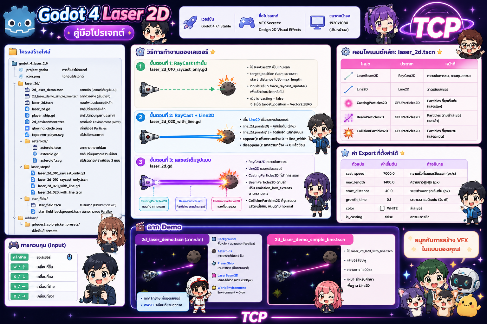
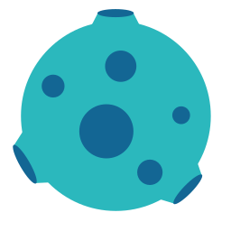
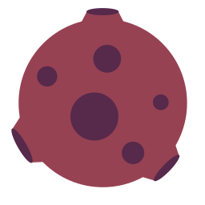
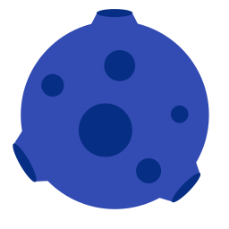
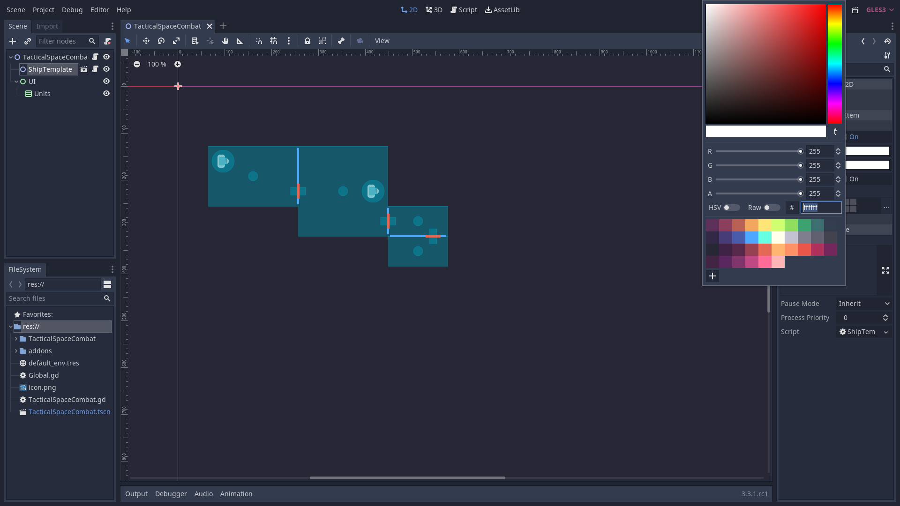
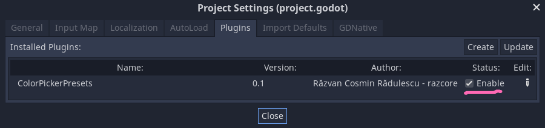

# Godot 4 Laser 2D - คู่มือโปรเจกต์



> เวอร์ชัน: Godot 4.7.1 Stable  
> ชื่อโปรเจกต์: VFX Secrets: Design 2D Visual Effects  
> ขนาดหน้าจอ: 1920x1080 (เต็มหน้าจอ)

---

## ภาพรวม

โปรเจกต์นี้เป็นตัวอย่างการทำเอฟเฟกต์ **เลเซอร์ 2 มิติ** ใน Godot 4 แสดงวิธีการสร้างลำเลเซอร์แบบโต้ตอบได้ด้วย RayCast, Line2D, และ Particles

---

## โครงสร้างไฟล์

```
godot_4_laser_2d/
├── project.godot                  # การตั้งค่าโปรเจกต์
├── icon.png                       # ไอคอนโปรเจกต์
├── screenshot.png                 # ภาพรวมโปรเจกต์
├── laser_2d/
│   ├── 2d_laser_demo.tscn         # ฉากหลัก (เลเซอร์เต็มรูปแบบ)
│   ├── 2d_laser_demo_simple_line.tscn  # ฉากตัวอย่าง (เส้นง่ายๆ)
│   ├── laser_2d.tscn              # คอมโพเนนต์เลเซอร์หลัก
│   ├── laser_2d.gd                # สคริปต์เลเซอร์หลัก
│   ├── player_ship.gd             # สคริปต์ควบคุมยานอวกาศ
│   ├── 2d_environment.tres        # การตั้งค่า Environment (Glow)
│   ├── glowing_circle.png         # เท็กซ์เจอร์ Particles
│   ├── topdown-player.svg         # สไปรต์ยานอวกาศ
│   ├── asteroids/
│   │   ├── asteroid.tscn          # ฉากดาวเคราะห์น้อย
│   │   ├── asteroid.gd            # สคริปต์หมุนดาวเคราะห์น้อย
│   │   └── asteroid*.svg          # สไปรต์ดาวเคราะห์น้อย 3 แบบ
│   ├── laser_steps/
│   │   ├── laser_2d_010_raycast_only.gd   # ขั้นตอนที่ 1: RayCast เท่านั้น
│   │   ├── laser_2d_010_raycast_only.tscn
│   │   ├── laser_2d_020_with_line.gd      # ขั้นตอนที่ 2: RayCast + Line2D
│   │   └── laser_2d_020_with_line.tscn
│   └── star_field/
│       ├── star_field.tscn        # สนามดาว (GPUParticles2D)
│       └── star_field_background.tscn  # สนามดาวแบบ Parallax
└── addons/
    └── gdquest_colorpicker_presets/  # ปลั๊กอินสี presets
```

---

## สไปรต์ในโปรเจกต์

### ยานอวกาศ


### ดาวเคราะห์น้อย

| ปกติ | สีแดง | สีน้ำเงินเข้ม |
|:----:|:-----:|:-------------:|
|  |  |  |

### เท็กซ์เจอร์ Particles


### ดาวฤกษ์


---

## การควบคุม (Input)

| ปุ่ม | หน้าที่ |
|------|---------|
| คลิกซ้าย | ยิงเลเซอร์ |
| W / ลูกศรขึ้น | เคลื่อนที่ขึ้น |
| S / ลูกศรลง | เคลื่อนที่ลง |
| A / ลูกศรซ้าย | เคลื่อนที่ซ้าย |
| D / ลูกศรขวา | เคลื่อนที่ขวา |

---

## วิธีการทำงานของเลเซอร์

### ขั้นตอนที่ 1: RayCast เท่านั้น (`laser_2d_010_raycast_only.gd`)

```
RayCast2D ──ยืดทีละน้อย──► ความยาวสูงสุด
```

- ใช้ `RayCast2D` เป็นแกนหลัก
- `target_position` ค่อยๆ ขยายจาก `start_distance` ไปยัง `max_length`
- ทุกเฟรมเรียก `force_raycast_update()` เพื่อเช็คว่าชนวัตถุหรือไม่
- เมื่อ `is_casting = false` จะรีเซ็ต `target_position = Vector2.ZERO`

### ขั้นตอนที่ 2: RayCast + Line2D (`laser_2d_020_with_line.gd`)

```
RayCast2D ──ยืด──► ตรวจจับชน
    │
    └── Line2D ──วาดเส้นตามผลลัพธ์──► แสดงผล
```

- เพิ่ม `Line2D` เพื่อแสดงเส้นเลเซอร์
- `line_2d.points[0]` = จุดเริ่มต้น (ด้านซ้าย)
- `line_2d.points[1]` = จุดสิ้นสุด (ปลายเลเซอร์หรือจุดชนวน)
- แอนิเมชัน `appear()`: เพิ่มความกว้างจาก 0 → `line_width`
- แอนิเมชัน `disappear()`: ลดความกว้างจากปัจจุบัน → 0 แล้วซ่อน

### ขั้นตอนที่ 3: เลเซอร์เต็มรูปแบบ (`laser_2d.gd`)

```
RayCast2D ──ยืด──► ตรวจจับชน
    │
    ├── Line2D ──เส้นเลเซอร์──► แสดงผล
    │
    ├── CastingParticles2D ── Particles ที่ปากกระบอก──► แสงเรือง
    │
    ├── BeamParticles2D ── Particles ตามลำเลเซอร์──► แสงลำ
    │   (ปรับ emission_box_extents ตามความยาว)
    │
    └── CollisionParticles2D ── Particles ที่จุดชนวน──► แสงระเบิด
        (แสดงเฉพาะเมื่อชนวัตถุ, หมุนตาม collision normal)
```

---

## คอมโพเนนต์หลัก: `laser_2d.tscn`

| โหนด | ประเภท | หน้าที่ |
|-------|--------|---------|
| LaserBeam2D | RayCast2D | ตรวจจับการชน, ควบคุมสถานะ |
| Line2D | Line2D | วาดเส้นเลเซอร์ |
| CastingParticles2D | GPUParticles2D | Particles ที่จุดเริ่มต้น (แสงเรือง) |
| BeamParticles2D | GPUParticles2D | Particles ตามลำเลเซอร์ (แสงลำ) |
| CollisionParticles2D | GPUParticles2D | Particles ที่จุดชนวน (แสงระเบิด) |

### ค่า Export ที่ตั้งค่าได้

| ตัวแปร | ค่าเริ่มต้น | คำอธิบาย |
|--------|------------|---------|
| `cast_speed` | 7000.0 | ความเร็วที่เลเซอร์ยืดออก (px/s) |
| `max_length` | 1400.0 | ความยาวสูงสุด (px) |
| `start_distance` | 40.0 | ระยะห่างจากจุดเริ่มต้น (px) |
| `growth_time` | 0.1 | ระยะเวลาแอนิเมชัน (วินาที) |
| `color` | WHITE | สีเลเซอร์ |
| `is_casting` | false | สถานะการยิง |

---

## ฉาก Demo

### `2d_laser_demo.tscn` (ฉากหลัก)

```
2DLaserDemo (Node2D)
├── Background (CanvasLayer, layer=-10)
│   ├── ColorRect (พื้นหลังสีเขียวเข้ม)
│   ├── StarField2 (สนามดาว)
│   ├── StarField3
│   └── StarField4
├── Asteroids (Node2D)
│   ├── Asteroid3  ─┐
│   ├── Asteroid6   │  ดาวเคราะห์น้อย 5 ชิ้น
│   ├── Asteroid7   │  แต่ละชิ้นมีขนาด/ตำแหน่งต่างกัน
│   ├── Asteroid8   │
│   └── Asteroid9  ─┘
├── PlayerShip (Node2D + player_ship.gd)
│   ├── LaserBeam2D (laser_2d.tscn instance)
│   └── Sprite2D (รูปยานอวกาศ)
└── WorldEnvironment (Environment + Glow)
```

- **PlayerShip**: หันไปทางเมาส์, กดคลิกซ้ายยิงเลเซอร์, WASD เคลื่อนที่
- **LaserBeam2D**: สีม่วง, ความยาว 2000px, ไม่ยิงเมื่อเริ่มเกม

### `2d_laser_demo_simple_line.tscn` (ฉากตัวอย่าง)

- ใช้ `laser_2d_020_with_line.tscn` แทนเลเซอร์เต็มรูปแบบ
- เลเซอร์สีชมพู, ความยาว 800px, ยิงเมื่อเริ่มเกม

---

## การตั้งค่า Environment

ไฟล์ `2d_environment.tres`:

| การตั้งค่า | ค่า | คำอธิบาย |
|-----------|-----|---------|
| `background_mode` | 3 | ใช้สีพื้นหลัง |
| `glow_enabled` | true | เปิดเอฟเฟกต์ Glow |
| `glow_blend_mode` | 1 | Softlight |
| `glow_hdr_threshold` | 0.9 | ค่า HDR ที่เริ่ม Glow |
| `glow_levels/4` | 0.5 | ระดับ Glow ช่วงกลาง |
| `glow_levels/5` | 0.3 | ระดับ Glow ช่วงสูง |

---

## สนามดาว (Star Field)

ใช้ `GPUParticles2D` สร้างดาวฤกษ์:

- **emission_shape**: Box (3) - ปล่อย Particles เป็นทรงกล่อง
- **emission_box_extents**: Vector3(960, 540, 0) - ครอบคลุมทั้งหน้าจอ
- **lifetime**: 6 วินาที
- **preprocess**: 6 วินาที (ให้ดาวเต็มจอตั้งแต่เริ่ม)

**Parallax Background** (`star_field_background.tscn`):
- 3 ชั้น แต่ละชั้นมี `motion_scale` ต่างกัน (0.1, 0.05, 0.01)
- สร้างเอฟเฟกต์ดาวลึกแบบ 3 มิติ

---

## ดาวเคราะห์น้อย

- ประเภท: `StaticBody2D` (ชนได้)
- ใช้ `CircleShape2D` radius=106.584
- `asteroid.gd`: หมุน sprite ด้วยความเร็วแบบสุ่ม `randf_range(PI/20, PI/4)` rad/s
- มี 3 แบบ: ปกติ, สีแดง, สีน้ำเงินเข้ม

---

## ปลั๊กอิน ColorPicker Presets



ปลั๊กอินโหลดสี presets จากไฟล์ `presets.gpl` ไปใส่ใน ColorPicker ของ Editor



เปิดใช้งานที่ **Project > Project Settings > Plugins > GDQuest ColorPicker Presets > Enabled**

---

## บั๊กที่แก้แล้วสำหรับ Godot 4.7.1

### 1. `laser_2d.gd:59` — Vector3 mutation

**ปัญหา**: `beam_particles.process_material.emission_box_extents.x = value`  
ไม่ทำงานเพราะ `emission_box_extents` ส่งค่า `Vector3` กลับมาเป็น copy  
การแก้ `.x` บน copy ไม่ส่งผลกลับไปที่ resource

**วิธีแก้**:
```gdscript
var extents: Vector3 = beam_particles.process_material.emission_box_extents
extents.x = laser_end_position.distance_to(laser_start_position) * 0.5
beam_particles.process_material.emission_box_extents = extents
```

### 2. `colorpicker_presets.gd:13` — `get_as_text(true)`

**ปัญหา**: Godot 4.7 ลบ parameter `keep_empty_lines` ออกจาก `FileAccess.get_as_text()`

**วิธีแก้**: เปลี่ยนเป็น `get_as_text()` (ไม่มี argument)

### 3. `colorpicker_presets.gd:24` — `get_editor_interface()`

**ปัญหา**: Godot 4.x ลบ method `EditorPlugin.get_editor_interface()`

**วิธีแก้**: เปลี่ยนเป็น `EditorInterface` singleton

---

## การรันโปรเจกต์

1. เปิด Godot 4.7.1
2. Import โปรเจกต์ `godot_4_laser_2d/`
3. เปิดฉาก `laser_2d/2d_laser_demo.tscn`
4. กด **F5** เพื่อรันเกม
5. ใช้ WASD เคลื่อนที่, คลิกซ้ายยิงเลเซอร์

---

## ลิขสิทธิ์

ดูไฟล์ `LICENSE` ในโฟลเดอร์หลัก
